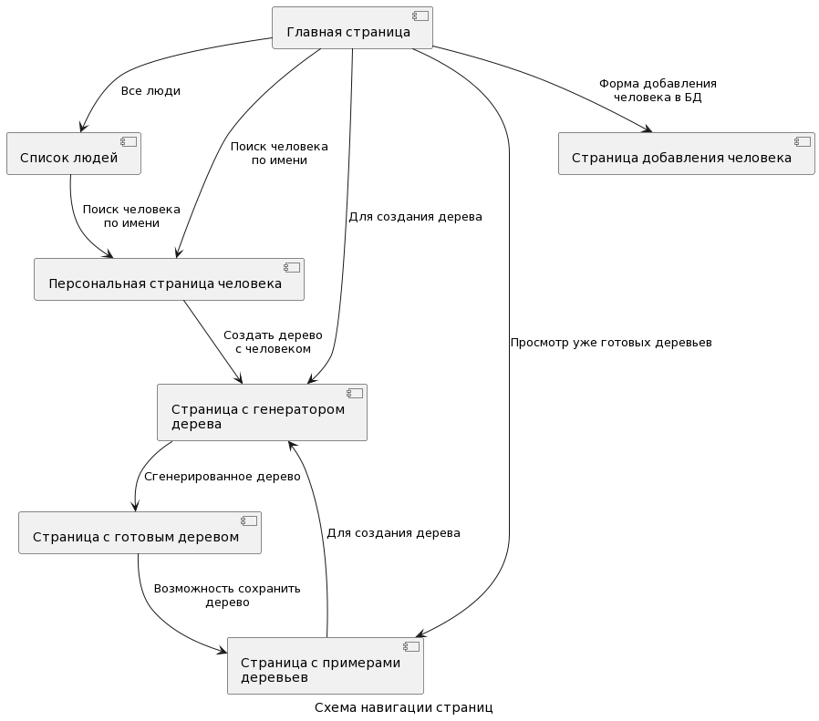
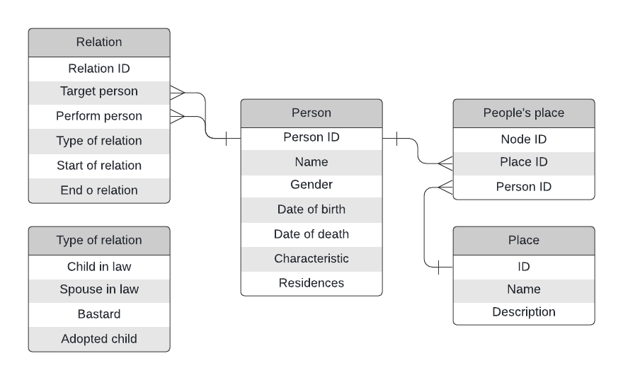

Генеалогическая информация о людях
=======================
Описание страниц
-----------------------

-----------------------
С любой страницы можно перейти на главную, нажав соответвующую кнопку.

### Главная страница
- Ссылка на список всех людей
- Форма для поиска человека по имени, отсылает на персональную страницу человека
- Ссылка на страницу для создания дерева
- Ссылка на страницу с примерами готовых деревьев

### Страница со списком всех людей
- Список всех людей, зарегистрированных в базу данных
- На каждого человека можно нажать, что приведет на его персональную страницу
- Сортировка по имени или дате рождения

### Персональная страница человека
- Возможность редактирования всех данных
- Имя, дата рождения и смерти(если актуально)
- Информация о человека, местах его жительства
- Ссылки на родителей, супруга, детей (если есть нужная информация в БД)

### Страница для создания дерева
Основная и самая главная страница сайта. Здесь имеется множество вариантов построения родственных связей: только родители, только дети, только внуки и т.п. Можно настроить параметры, которые ограничивают степень кровного родства(в коленах), а так же степень родства вверх или вниз по "стволу" дерева (выводить дерево только до деда/бабушки или прадеда/прабабушки, только до детей/только до внуков и т.п.). Так же имеется возможность выбрать двух людей и построить все связи между ними. Основная идея в том, что конкретные деревья не хранятся(кроме тех, что на странице с примерами), а хранится вся необходимая информация для их построения. Если запрашиваемое дерево уже есть в примерах, то новое дерево не строится, а выдается ссылка на готовое дерево. Дерево будет строиться при помощи языка UML.
- Кнопка выбора человека/2 человек
- Настройки для требуемого дерева

### Страница с готовым деревом
- Дерево, сгенерированное по запросу на предыдущей странице
- Имеется возможность скачать дерево или загрузить его в базу готовых деревьев

### Страница с примерами деревьев
- Ссылка на страницу-генератор деревьев
- Кнопки для загрузки и скачивания деревьев

### Страница добавления человека в БД
- Формы для ввода всех данных о человеке
- Кнопка с подтверждением добавления человека

Схема базы данных
-----------------

Сценарии использования
----------------------

- Добавление человека
    - Перейти на главную страницу
    - Нажать на кнопку "Добавить человека"
    - Заполнить необходимые поля, подтвердить изменения в базе данных
    
- Генерация генеалогического дерева человека
	- Перейти на главную страницу
	- Перейти на страницу для генерации дерева
	- Выбрать все необходимые параметры для нужного дерева
	- Нажать кнопку "Получить дерево"
	- Перейти на страницу, на которой будет сгенерированное дерево
	
- Просмотр уже сгенерированных деревьев
	- Перейти на главную страницу
	- Перейти на страницу с примерами
	- Просмотреть/Скачать дерево, загрузить/создать новое дерево
	
- Поиск человека по имени
	- Перейти на главную страницу
	- Перейти на страницу со списком всех людей
		- Отсортировать список по имени(дате рождения)
		- Перейти на персональную страницу человека
	- Нажать на кнопку "Поиск по имени"
		- Ввести имя нужного человека
		- В случае совпадения имен, можно определить нужного человека по дате рождения

